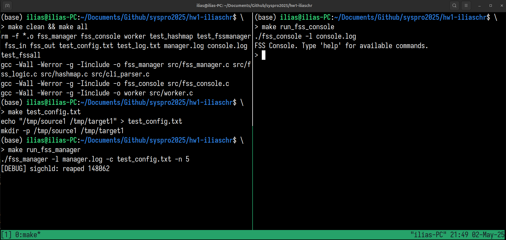

# FileSync System - FSS

For this project, for testing I used the Acutest test framework and for the hashmap
the Algorithms in C book by Robert Sedgewick.

I also used code from the slides of the corresponding Systems Programming course.

Just like the name suggests I implemented a FileSync System that can sync files
(IMPORTANT: the directories have a depth of 1).

## Usage: 

**Always run `fss_manager` first.**

To use this tmux is suggested so run:

```bash
tmux
```
with `Ctl` + `B` + `%` you can open a second terminal.

A `Makefile` is provided, so you don't need to compile manually.

The first command you need to run is:

```bash
make all
```

After that in one terminal you need to run for tests:

```bash
make test_config.txt
```
This will provide you with some test files that you can use.

This will use the auto-generated files:

```bash
make run_fss_manager
```

Same goes for this one:

```bash
make run_fss_console
```

In the `Makefile` there are also commands that use `valgrind` you don't need to use them
if the badge says it's passing that means that the `test_fssall.c` has no leaks.

Using the executables without the test files means that you have your own, you can use them like this:

```bash
./fss_console -l <console-logfile>
```
and 

```bash
./fss_manager -l <manager_logfile> -c <config_file> -n <worker_limit>
```

Further information can be found in the `Makefile`.

Example Screenshot of the program running:



## fss_script.sh

Making it executable:

```bash
chmod +x fss_script.sh
```

Usage:

```bash
./fss_script.sh -p <path> -c <command>
```

Commands for `command` can be found in the `2025-syspro-hw1.pdf`, but I will also list them here:
- listAll: Searches in the log-file (path) and shows all the directories with status (Success, Error, Partial)
- listMonitored: Lists directories that are being monitored.
- listStopeed: Lists directories that are not being watched.
- purge: Deletes dir/file in path.

### Resources & Bibliography

[Course Site](https://cgi.di.uoa.gr/~mema/courses/k24/k24.html)

[Programming for Unix Book]()

[Algorithms in C Book by Rober Sedgewick]

[Man pages](https://linux.die.net)
